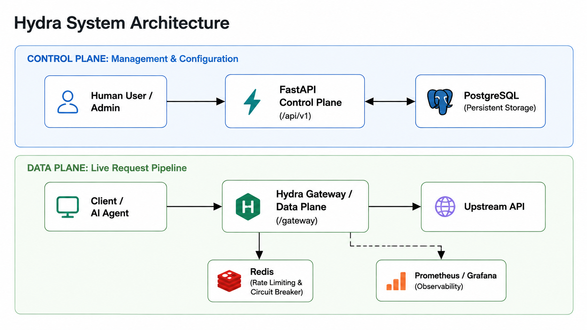

# Hydra

## Production-Grade API Gateway and Developer Platform for AI Applications

Hydra is an API gateway and API management platform designed to centralize common API infrastructure such as authentication, routing, rate limiting, reliability controls, and observability.

Instead of implementing these concerns separately inside every application, Hydra provides a centralized layer through which applications and AI agents can access configured APIs.

[](https://www.python.org/)
[](https://fastapi.tiangolo.com/)
[](https://www.postgresql.org/)
[](https://redis.io/)
[](https://www.sqlalchemy.org/)
[](https://www.docker.com/)
[](https://prometheus.io/)
[](https://grafana.com/)

[](https://youtu.be/MG_G-FWtPFU)

---

## Table of Contents

- [Overview](#overview)
- [Architecture](#architecture)
- [Technology Stack](#technology-stack)
- [Core Features](#core-features)
- [Control Plane](#control-plane)
- [Data Plane](#data-plane)
- [Playground](#playground)
- [Gateway Request Lifecycle](#gateway-request-lifecycle)
- [Authentication Design](#authentication-design)
- [Observability](#observability)
- [Quick Start](#quick-start)
- [Running Without Docker Compose](#running-without-docker-compose)
- [Testing](#testing)
- [Project Structure](#project-structure)
- [Engineering Decisions](#engineering-decisions)
- [Development Conventions](#development-conventions)
- [Demo](#demo)
- [License](#license)

---

## Overview

Modern applications often depend on multiple APIs and backend services. As the number of integrations grows, applications can end up implementing the same infrastructure repeatedly:

- API authentication
- Access control
- Request routing
- Rate limiting
- Failure handling
- Request logging
- Monitoring

Hydra moves these responsibilities into a centralized gateway.

A client sends a request to Hydra, Hydra applies the configured policies, forwards the request to the appropriate upstream service, and returns the response.

This keeps application business logic separate from common API infrastructure and provides a central place to manage and observe API traffic.

---

## Architecture

Hydra is built around a separation between the **Control Plane** and the **Data Plane**.

### High-Level Architecture




The architecture consists of three main components:

### Control Plane

The Control Plane is responsible for configuration and management.

It provides authenticated APIs for:

- Organizations
- Projects
- Upstream services
- Routes
- API keys
- Analytics

Configuration is persisted in PostgreSQL.

### Data Plane

The Data Plane handles actual API traffic.

Requests entering `/gateway` are processed through the configured authentication, routing, authorization, rate limiting, and reliability policies before being forwarded to the upstream service.

The hot path is designed to avoid unnecessary database queries by keeping routing configuration in memory.

### Playground

The Playground provides a simple Postman-like interface for testing requests through the gateway.

It makes it possible to test the complete Data Plane without requiring an external API testing tool.

---

## Technology Stack

| Technology | Where It Is Used |
|---|---|
| Python 3.12+ | Core application |
| FastAPI | Control Plane API and gateway application |
| PostgreSQL | Persistent configuration and request data |
| SQLAlchemy 2.0 | Async database access and ORM |
| asyncpg | PostgreSQL async driver |
| Redis | Rate limiting, circuit breaker state, and runtime state |
| Lua | Atomic Redis rate-limiting operations |
| HTTPX | Asynchronous upstream request forwarding |
| Pydantic | Request and response validation |
| JWT | Control Plane authentication |
| Argon2id | Password hashing |
| SHA-256 | API key hashing |
| structlog | Structured application logging |
| Prometheus | Metrics collection |
| Grafana | Metrics visualization |
| Docker | Containerization |
| Docker Compose | Local multi-service environment |
| Alembic | Database migrations |
| pytest | Testing |
| Ruff | Linting and formatting |
| mypy | Static type checking |

---

## Core Features

### Centralized API Key Management

Hydra provides a central place to create, revoke, and manage API keys used by applications and AI agents.

API keys are stored as hashes rather than plaintext secrets.

Example key format:

```text
hk_live_...
````

### Intelligent Routing

Routes can be configured to forward requests to different upstream services based on path prefixes.

For example:

```text
/gpt4      -> OpenAI
/claude    -> Anthropic
/internal  -> Internal services
```

Routes are loaded from PostgreSQL and represented in an in-memory Trie.

This allows the gateway to perform route matching without querying the database for every request.

### Rate Limiting

Each route can have a configurable requests-per-minute limit.

Hydra implements sliding-window rate limiting using:

* Redis sorted sets
* Request timestamps
* Lua scripting
* Atomic check-and-update operations

Using a sliding window avoids the boundary-burst problem found in simple fixed-window implementations.

### Circuit Breaker

Hydra protects upstream services using a Redis-backed circuit breaker.

The state machine is:

```text
CLOSED
   |
   | repeated failures
   v
 OPEN
   |
   | recovery timeout
   v
HALF-OPEN
   |
   | successful probe
   v
CLOSED
```

If an upstream service repeatedly fails, Hydra can temporarily stop forwarding requests to it instead of continuously sending traffic to an unhealthy service.

### Authorization

API keys can be configured with scopes and allowed HTTP methods.

Before forwarding a request, Hydra verifies:

1. The API key
2. The configured route
3. Required scope
4. Allowed HTTP method
5. Rate limit
6. Upstream circuit state

### Observability

Hydra provides structured logging and metrics for gateway traffic.

Requests include:

* `x-request-id`
* `x-correlation-id`
* HTTP method
* route
* response status
* latency
* upstream information

Prometheus collects application metrics and Grafana can be used to visualize them.

---

## Control Plane

The Control Plane is exposed under:

```text
/api/v1
```

It provides APIs for managing Hydra's configuration.

### Organizations and Projects

Hydra uses a hierarchy of:

```text
Organization
    |
    +-- Project
          |
          +-- Upstreams
          |
          +-- Routes
          |
          +-- API Keys
```

This allows configuration to be isolated between different projects and teams.

### Upstreams

An upstream represents a backend service that Hydra forwards requests to.

Example:

```text
https://api.example.com
```

### Routes

Routes connect gateway paths to upstream services.

For example:

```text
/gateway/demo/get
        |
        v
Configured upstream
        |
        v
https://example-api.com/get
```

### API Keys

API keys authenticate machine-to-machine requests to the Data Plane.

Keys can be created with specific scopes and permissions.

### Swagger UI

The Control Plane is automatically documented using FastAPI's OpenAPI integration.

Swagger UI can be used to:

* Register and authenticate users
* Authorize with JWT
* Create organizations
* Create projects
* Configure upstreams
* Configure routes
* Create API keys
* Test management APIs

---

## Data Plane

The Data Plane is exposed through:

```text
/gateway
```

This is where actual API traffic flows.

A typical request looks like:

```text
Client
   |
   v
Hydra Gateway
   |
   +--> Authenticate API Key
   |
   +--> Match Route
   |
   +--> Check Scope
   |
   +--> Check HTTP Method
   |
   +--> Rate Limit
   |
   +--> Circuit Breaker
   |
   v
Upstream API
   |
   v
Hydra Gateway
   |
   v
Client
```

The Data Plane is designed to keep the request path lightweight and avoid database access during normal route matching.

---

## Playground

Hydra includes a built-in Playground for testing gateway requests.

The Playground provides a Postman-like interface where developers can enter:

* HTTP method
* Gateway URL
* API key
* Request headers
* Request body

The request is then sent through Hydra's actual Data Plane.

This makes it useful for demonstrating and debugging the complete gateway flow without requiring a separate API client.

The Playground also keeps request history in browser `localStorage` for easier retesting.

---

## Gateway Request Lifecycle

A request through Hydra follows this general flow:

```text
1. Extract API key
2. Verify API key
3. Load route configuration from memory
4. Match request path using the Trie
5. Check API key scope
6. Check HTTP method
7. Apply Redis sliding-window rate limit
8. Check circuit breaker state
9. Build the target upstream URL
10. Forward request using HTTPX
11. Record circuit breaker outcome
12. Return upstream response
13. Record request information
```

The important part of this design is that route matching does not require a database query for every request.

---

## Authentication Design

Hydra separates authentication for human users from authentication for machine-to-machine traffic.

| Authentication | Used For            | Storage / Hashing             |
| -------------- | ------------------- | ----------------------------- |
| JWT            | Control Plane users | JWT access and refresh tokens |
| Argon2id       | User passwords      | Password hashing              |
| API Keys       | Data Plane clients  | SHA-256 hashes                |

### Control Plane

Human users authenticate using email/password credentials.

Passwords are hashed using Argon2id before being stored.

JWT access tokens are then used to authenticate Control Plane requests.

### Data Plane

Applications and AI agents authenticate using API keys.

The API key itself is not stored in the database. Hydra stores a SHA-256 hash and uses the key prefix for efficient lookup.

The separation keeps the authentication mechanisms appropriate for their different use cases.

---

## Engineering Decisions

### In-Memory Trie Routing

A database lookup on every gateway request would add unnecessary latency and load to PostgreSQL.

Hydra therefore loads route configuration into an in-memory Trie.

The lookup complexity is approximately:

```text
O(L)
```

where `L` is the number of path segments being evaluated.

The router is also segment-aware, preventing incorrect matches such as:

```text
/api
```

matching:

```text
/apikeys
```

### Atomic Rate Limiting

The Redis rate limiter uses a sorted set containing request timestamps.

The check and update operations are executed together using a Lua script.

This is important because multiple requests may reach the gateway concurrently. The operation needs to be atomic so that two requests cannot both observe the same available slot and bypass the limit.

### Distributed Circuit Breaker

Circuit breaker state is stored in Redis instead of process memory.

This allows multiple application workers to share the same state.

During the HALF-OPEN state, Redis `SET NX` is used to ensure that only one worker performs the recovery probe.

---

## Observability

Hydra uses structured logging and Prometheus metrics to provide visibility into gateway traffic.

### Structured Logging

Logs are generated using `structlog`.

Each request can include:

```text
x-request-id
x-correlation-id
HTTP method
route
status code
latency
upstream
```

Request and correlation IDs make it easier to trace a request through different parts of the system.

### Prometheus

Prometheus is used to collect application and gateway metrics such as:

* Request counts
* Response latency
* Error rates
* Gateway activity

### Grafana

Grafana can be used to visualize the collected metrics through dashboards.

---

## Quick Start

### Prerequisites

* Python 3.12+
* Docker
* Docker Compose

### Start Hydra

Clone the repository and configure the environment:

```bash
cp .env.example .env
```

Start the services:

```bash
docker compose up --build
```

Once the services are healthy, run the database migrations:

```bash
alembic upgrade head
```

### Available Interfaces

| Service    | URL                                 |
| ---------- | ----------------------------------- |
| Swagger UI | `http://localhost:8000/docs`        |
| Playground | `http://localhost:8000/playground/` |
| Prometheus | `http://localhost:9090`             |
| Grafana    | `http://localhost:3000`             |

---

## Running Without Docker Compose

PostgreSQL:

```bash
docker run -d \
  --name hydra-pg \
  -e POSTGRES_USER=hydra \
  -e POSTGRES_PASSWORD=hydra_secret \
  -e POSTGRES_DB=hydra \
  -p 5432:5432 \
  postgres:16-alpine
```

Redis:

```bash
docker run -d \
  --name hydra-redis \
  -p 6379:6379 \
  redis:7-alpine
```

Create a Python environment:

```bash
python -m venv .venv
source .venv/bin/activate
```

Install dependencies:

```bash
pip install -e ".[dev]"
```

Run migrations:

```bash
alembic upgrade head
```

Start the application:

```bash
uvicorn main:app --reload
```

Register a user:

```bash
curl -X POST http://localhost:8000/api/v1/auth/register \
  -H "Content-Type: application/json" \
  -d '{"email":"you@example.com","password":"yourpassword123"}'
```

---

## Testing

Hydra separates unit tests from infrastructure-dependent integration tests.

Run unit tests:

```bash
pytest -m "not infra"
```

Run integration tests:

```bash
pytest -m infra
```

Integration tests require PostgreSQL and Redis to be available.

---

## Project Structure

```text
hydra/
├── api/                # FastAPI routers
│   ├── control plane/
│   └── data plane/
│
├── gateway/            # Gateway runtime
│   ├── trie.py
│   ├── rate_limiter.py
│   └── circuit_breaker.py
│
├── models/             # SQLAlchemy ORM models
├── repositories/       # Database access layer
├── services/           # Business logic
├── schemas/            # Pydantic request/response models
├── providers/          # Swappable implementations
├── security/           # Roles, scopes, and security logic
├── alembic/             # Database migrations
├── web/
│   └── playground/     # Playground UI
├── tests/              # Unit and integration tests
├── core/               # Configuration and shared infrastructure
└── main.py             # Application entry point
```

---

## Development Conventions

Hydra follows a layered architecture:

```text
Router
   |
   v
Service
   |
   v
Repository
   |
   v
Model / Database
```

### Type Checking

The project targets Python 3.12+ and uses strict static type checking:

```bash
mypy --strict .
```

### Linting

```bash
ruff check .
```

### Formatting

```bash
ruff format .
```

### Error Handling

Application-level errors use Hydra-specific exception classes rather than raising raw `HTTPException` throughout the application.

---

## Demo

A complete demonstration of Hydra covers:

1. Control Plane authentication
2. Organization and project creation
3. Upstream configuration
4. Route configuration
5. API key creation
6. Sending a request through the Playground
7. Gateway authentication and routing
8. Upstream forwarding
9. Successful response
10. Request analytics and observability

### Watch the Demo

[](https://youtu.be/MG_G-FWtPFU)

---

## Repository

The complete source code is available on GitHub.

<!-- Add your GitHub repository URL here -->

---

## License

Add the project license here.

---

## Acknowledgments

Hydra was built using FastAPI, PostgreSQL, Redis, SQLAlchemy, HTTPX, Prometheus, Grafana, and Docker.


**One gateway for your APIs.**


